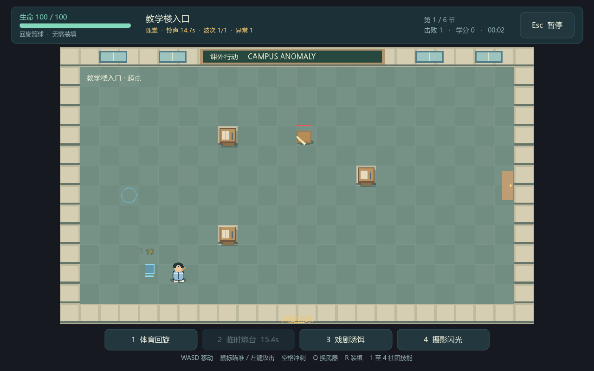

# 校园异常：战斗原型验证报告

日期：2026-10-08。版本：0.1.0。引擎：`4.7.2.stable.official.ed1daf0bf`。

## 验证结果

源工程和独立便携 PCK 版本均通过 122 项自动检查，进程退出码为 0。最终运行日志没有 `ERROR` 或 `SCRIPT ERROR`。触发配额检查有两条预期上限提示，分别用于确认配额外事件被拒绝。

| 类别 | 实际检查 |
|---|---|
| 数据 | 武器、敌人、房间、技能和词条加载，数据自洽 |
| 伤害 | 分组叠加、防御、条件效果、攻击去重 |
| 动作 | 输入移动、冲刺无敌、真实直尺扇形与敌人近战 |
| 时钟 | 玩家不启用自身物理回调；60 帧只推进 1 秒；暂停冻结时钟和技能 |
| 投射物 | 高速墙体扫掠、反弹位置、敌方伤害不继承玩家加成 |
| 成长 | 层数上限、实际回血触发次数、击杀和清房回血、减伤到期 |
| 地图 | 20 个种子的连通性、同种子生成一致、模板站立与威胁预算、绕桌寻路 |
| 流程 | 实际敌人生成、先奖励后选路、重复和无效奖励拒绝、换房清理 |
| 结算 | 死亡、重开、六节波次生成到 Boss 通关、避免重复结算 |
| 存档 | 独立 qa 路径、真实回读、版本迁移、损坏主文件恢复、保留有效备份 |

测试清除所有波次和 Boss 时使用伤害注入，检验流程和结算。未把该结果当作人工通关、难度合理或平衡完成的证据。近战检查清理残留子弹，并核对所用武器，避免由旧投射物造成误判。

日志：[源工程检查](../../output/prototype/selftest.log)、[便携版本检查](../../output/prototype/portable-selftest.log)。复查入口：[检查战斗原型.cmd](../../检查战斗原型.cmd)。

## 实际窗口

开始、战斗、Boss、奖励、选路、暂停和死亡共七种模式完成截图并以退出码 0 结束。已检查中文字体、居中面板、按钮换行、技能栏、完整房间镜头和 Boss 血条位置。

战斗截图工具使用固定种子和自动输入，Boss 模式直接进入考场；这是画面与运行验证。实际操作手感、受伤压力及课程是否有趣需要人工试玩。

其他截图：[开始](../../output/prototype/menu.png)、[奖励](../../output/prototype/reward.png)、[选路](../../output/prototype/routes.png)、[暂停](../../output/prototype/pause.png)、[失败](../../output/prototype/death.png)、[Boss](../../output/prototype/boss.png)。

## 当前机器的短时采样

配置为 Windows 11、AMD Ryzen 9 7940H、约 15.2 GiB 可见物理内存、RTX 4060 Laptop GPU。窗口 1280×800，Compatibility 渲染，目标上限 60 FPS。

| 场景 | 平均帧时间 | P95 帧时间 | 平均 FPS | Godot 静态分配 | 采样到的进程工作集峰值 |
|---|---|---|---|---|---|
| 首间战斗房 | 16.67 ms | 17.21 ms | 60.0 | 106.0 MiB | 243.3 MiB |
| Boss 考场 | 16.67 ms | 17.09 ms | 60.0 | 106.1 MiB | 250.5 MiB |

截图工具跳过前 30 帧，按真实时钟计算帧时间，避免命中停顿改变游戏 delta 后造成推算偏高。工作集每 200 ms 采样，可能漏掉更短的峰值。场景持续约 2 至 7 秒，没有进行高密度压力、低端硬件、移动设备或长期运行测试。这些结果不构成最低配置承诺。

原始采样：[战斗日志](../../output/prototype/battle.log)、[Boss 日志](../../output/prototype/boss.log)。

## 包体与构建

- 独立试玩目录位于 `output/windows/`，含 EXE、PCK、说明和引擎许可。
- 引擎 EXE 为 180,858,888 字节，约 172.5 MiB。复用了编辑器构建，因此包含正式运行模板无需携带的功能。
- PCK 约 223 KiB，包含脚本、配置、JSON 数据、场景和图标。画面与音效在运行时生成。
- [便携 ZIP](../../output/校园异常_Windows试玩_v0.1.zip) 为 86,382,321 字节，约 82.4 MiB，完整性检查通过。文件大小和 SHA-256 见 [构建清单](../../output/prototype/build-manifest.json)。
- 便携目录不依赖源工程的 `.godot` 缓存，已经在该目录独立启动并运行自动检查。
- 打包导出退出码为 0，结束时曾提示编辑器设置的 safe save 失败。资源包保存完成，独立启动和全部回归检查通过；正式构建环境还需清理该编辑器设置问题。
- 正式运行模板、完整美术素材、iOS 导出、平台签名及 Steam 接入尚未测量或验证。

原型构建依据 [Godot PCK 导出说明](https://docs.godotengine.org/en/stable/tutorials/export/exporting_pcks.html)。随包保存当前引擎返回的许可全文、第三方版权和许可文本，接口依据 [Engine 官方文档](https://docs.godotengine.org/en/stable/classes/class_engine.html)，许可规则见 [Godot 官方许可](https://godotengine.org/license/)。

## 下一轮的具体任务

1. 人工试玩 10 至 15 分钟，记录武器手感、攻击可读性和铃声体验。
2. 根据反馈调整前摇、后摇、射程、冲刺与敌人密度。
3. 确定正式美术风格，制作一个完整角色和一间教室的素材样本。
4. 接入学科奖励加权和永久解锁，再测量目标硬件及专用导出模板。

[试玩说明](战斗原型试玩说明.md) · [逐次记录](../../CHANGELOG.md)
